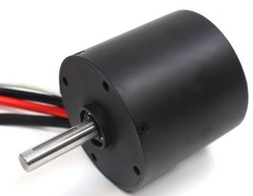
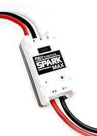
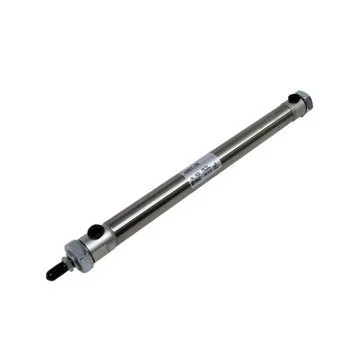
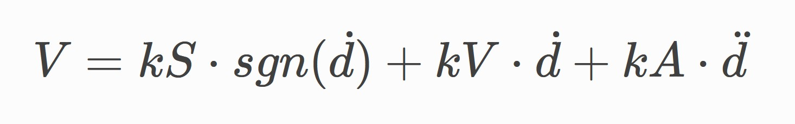

# NewbieBot

In this lab, you'll be learning about common robot hardware, subsystems, and how to write robot code!

<details>
<summary>
<h2>Robot Hardware</h2>
</summary>
<br>

### Motors

Motors are one of the most common components on the robot. They turn voltage into a rotation on an output shaft.

#### NEO



We use NEOs everywhere on our robot, so its good to be familiar with how to use them in code.
### Motor Controllers

Motor controllers are how robot code interfaces with motors. They're the middleman between you and the motor, translating your instructions into voltages for the motors.

#### CANSparkMax



`CANSparkMax` is the class/type in java used to control NEO motors.

### Solenoids

Solenoids are electronic components that control the air pressure in a piston, causing it to extend or retract.

There are two types of solenoids: normal solenoids and double solenoids. <b>Double</b> solenoids can force the piston to be extended, retracted, or do nothing. <b>Normal</b> solenoids can only force the solenoid to be extended or retracted.



</details>

## Subsystems

Subsystems represent and control mechanisms on the robot like the drivetrain, intake, and shooter. Subsystems are some of the most important parts of our robot code.

In code, a subsystem is a class that has fields for hardware that is physically on the mechanism, including motors, solenoids (pistons), and encoders. The subsystem's methods represent the behaviors that we want the real mechanism to have.

In this lab you'll be coding your own subsystems!

<details>
<summary>
<h2>Intake</h2>
</summary>
<br>

First, we're going to be coding an intake, which brings balls into the robot. The intake is has an arm that hangs in front of the robot with spinning wheels to force balls inwards, and this arm can retract to perpendicular.

The intake has one NEO to drive the wheels on the arm and a double solenoid that controls it extending or retracting.

### Intake.java Template

[Here](src/main/java/com/stuypulse/robot/subsystems/Intake.java) is your intake file.

<b>Challenge:</b> fill in the empty methods in Intake.java with the functionality that the comments talk about using hardware class tables below.

```java
public class Intake extends SubsystemBase {

    CANSparkMax motor;
    DoubleSolenoid piston;
    
    // initialize your motor and piston in here!
    public Intake() {}
    
    // puts the intake down by extending the piston
    public void extend() {}
    // brings the intake up by retracting the piston
    public void retract() {}
    // runs the motor at full speed to spin wheels that bring balls in the robot
    public void acquire() {}
    // runs the motor backwards spin wheels that spit balls out of the robot
    public void deacquire() {}
    // stop the drive motor so that balls are not brought in or out
    public void stop() {}
    
}
```

</details>

<details>
<summary>
<h2>Shooter and Feedforward</h2>
</summary>
<br>

The shooter is another important mechanism on the robot, and controlling it requires some new algorithms compared to our intake code. The shooter has a flywheel that speeds balls up and ejects them out of the robot. It also has a feeder wheel that pushes balls up towards the flywheel and a solenoid that extends to change the shooting angle. The last piece of hardware it has is a solenoid (piston) that changes the angle of the shooter.

The shooter has 3 NEOs and a normal solenoid (not DoubleSolenoid, just Solenoid). One of these motors spins the feeder wheel, which pushes balls up towards the shooter flywheel, while the other two motors work together to spin the shooter flywheel. Last, the solenoid controls extending the hood, which changes the shooting angle.

With the tools we have right now, keeping a flywheel at a certain RPM isn't possible. The first tool we'll need is <b>Feedforward</b>.

### Controlling the RPM with Feedforward

We're going to be using the Feedforward algorithm which <b>calculates the voltage that the motor should run at given the target RPM</b>. In the future we're going to use another class that calculates this for us, but today we're going to implement the algorithm on our own.



V: output voltage to feed to the motor<br>
kS, kV, kA: constant values (we will give you these)<br>
sgn: the sign function (-1 if negative, 1 if positive)<br>
d with one dot: the target rpm of the motor<br>
d with two dots: the target acceleration of the motor (we'll ignore this)<br>

### Encoders

In the intake, we didn't need to know the speed that the motor was running at - we just wanted to run it at full speed. But in the shooter, we might want to know if the RPM is what we're expecting it to be to be. We can do this with Encoders. As the motor turns, the encoder reads pulses and can calculate the number of rotations the motor has gone.

### Shooter.java

[Here](src/main/java/com/stuypulse/robot/subsystems/Shooter.java) is your shooter file.

<b>Challenge:</b> fill in the empty methods in Shooter.java with the functionality that the comments talk about using hardware class tables below.

```java
public class Shooter extends SubsystemBase {

    double shooterKs = 0.17118;
    double shooterKv = 0.0020763;
    double shooterKa = 0.00011861;

    double feederKs = 0.16971;
    double feederKv = 0.0021435;
    double feederKa = 0.00012423;

    CANSparkMax shooterA;
    CANSparkMax shooterB;
    CANSparkMax feeder;

    RelativeEncoder shooterEncoder;
    RelativeEncoder feederEncoder;
    
    double targetShooterRPM;
    double targetFeederRPM;

    Solenoid hoodPiston;

    public Shooter() {}

    // sets the RPM that the shooter is trying to reach
    public void setShooterRPM(double rpm) {}
    
    // sets the RPM that the feeder is trying to reach
    public void setFeederRPM(double rpm) {}

    // extend the hood solenoid to increase the shooter angle
    public void extendHood() {}

    // retract the hood solenoid to decrease the shooter angle
    public void retractHood() {}

    // a special method that's run by the robot every 0.02 seconds
    // set the voltage of the motors in here using the feedforward equation!
    public void periodic() {}
}
```

</details>

## Ports

<table>
    <thead>
        <tr>
            <th>Mechanism</th>
            <th>Hardware</th>
            <th>Port</th>
        </tr>
    </thead>
    <tbody>
        <tr>
            <td>Intake</td>
            <td>Motor (CANSparkMax)</td>
            <td>40</td>
        </tr>
        <tr>
            <td>Intake</td>
            <td>DoubleSolenoid extend port</td>
            <td>2</td>
        </tr>
        <tr>
            <td>Intake</td>
            <td>DoubleSolenoid retract port</td>
            <td>3</td>
        </tr>
        <tr>
            <td>Shooter</td>
            <td>Motor A</td>
            <td>20</td>
        </tr>
        <tr>
            <td>Shooter</td>
            <td>Motor B</td>
            <td>21</td>
        </tr>
        <tr>
            <td>Shooter</td>
            <td>Feeder motor</td>
            <td>22</td>
        </tr>
        <tr>
            <td>Shooter</td>
            <td>Hood solenoid (piston)</td>
            <td>5</td>
        </tr>
    </tbody>
</table>

## Hardware Classes

### CANSparkMax

<table>
    <thead>
        <tr>
            <th>Method</th>
            <th>Description</th>
            <th>Returns</th>
        </tr>
    </thead>
    <tbody>
        <tr>
            <td>CANSparkMax(int port, type)</td>
            <td>Constructor, takes in a port and a type. Type is normally MotorType.kBrushless.</td>
            <td>void</td>
        </tr>
        <tr>
            <td>get()</td>
            <td>Returns the set speed of the motor from -1.0 to 1.0.</td>
            <td>double</td>
        </tr>
        <tr>
            <td>set(double speed)</td>
            <td>Sets the speed of the motor from -1.0 to 1.0.</td>
            <td>void</td>
        </tr>
        <tr>
            <td>setInverted(boolean inverted)</td>
            <td>Inverts the direction of the motor spinning, takes in a true/false inverted value.</td>
            <td>void</td>
        </tr>
        <tr>
            <td>setVoltage(volts)</td>
            <td>Sets the voltage of the motor directly, usually between -12.0 and 12.0 volts.</td>
            <td>void</td>
        </tr>
        <tr>
            <td>stopMotor()</td>
            <td>Stops the motor.</td>
            <td>void</td>
        </tr>
        <tr>
            <td>getEncoder()</td>
            <td>Gets the encoder attached to the motor</td>
            <td>RelativeEncoder</td>
    </tbody>
</table>

### DoubleSolenoid

<table>
    <thead>
        <tr>
            <th>Method</th>
            <th>Description</th>
            <th>Returns</th>
        </tr>
    </thead>
    <tbody>
        <tr>
            <td>DoubleSolenoid(type, int extendPort, int retractPort)</td>
            <td>Constructor, takes in a type which is normally PneumaticsModuleType.CTREPCM and two ports.</td>
            <td>void</td>
        </tr>
        <tr>
            <td>get()</td>
            <td>Returns which state the solenoid is in (extended or retracted). If it is extended, the return value will be Value.kForward, Value.kReverse, or Value.kOff.</td>
            <td>Value</td>
        </tr>
        <tr>
            <td>set(value)</td>
            <td>Sets the solenoid to be either Value.kForward, Value.kReverse, or Value.kOff</td>
            <td>void</td>
        </tr>
    </tbody>
</table>

### Solenoid

<table>
    <thead>
        <tr>
            <th>Method</th>
            <th>Description</th>
            <th>Returns</th>
        </tr>
    </thead>
    <tbody>
        <tr>
            <td>Solenoid(type, int port)</td>
            <td>Constructor, takes in a type which is normally PneumaticsModuleType.CTREPCM and a port.</td>
            <td>void</td>
        </tr>
        <tr>
            <td>get()</td>
            <td>Returns a boolean if the solenoid is extended or not.</td>
            <td>boolean</td>
        </tr>
        <tr>
            <td>set(boolean on)</td>
            <td>Sets the solenoid to extended if true or off if false.</td>
            <td>void</td>
        </tr>
    </tbody>
</table>

### RelativeEncoder

<table>
    <thead>
        <tr>
            <th>Method</th>
            <th>Description</th>
            <th>Returns</th>
        </tr>
    </thead>
    <tbody>
        <tr>
            <td>getVelocity()</td>
            <td>Returns the motor's velcotity in RPM.</td>
            <td>double</td>
        </tr>
    </tbody>
</table>
